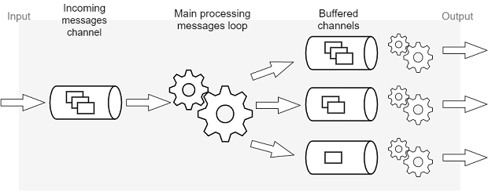

# IoT Control and Share

IoT platform for controlling devices remotely using mobile application or web application


## Projects

* [IoT Hub](https://github.com/naumchevski/iothub/) - Handles the communication.
* [IoT Web](https://github.com/naumchevski/iotweb/) - Web application, interface for end users.
* [IoT Manager](https://github.com/naumchevski/iotmanager/) - Android mobile application for controlling the channels.
* [IoT Ware](https://github.com/naumchevski/iotware/) - Code written in Arduino IDE for esp9266 based devices. Good example how to connect esp8266 with channels via WebSockets.
* [IoT Proxy](https://github.com/naumchevski/iotproxy/) - Establishes secure connection for "IoT Ware" devices. IoT Proxy is a bridge that is connected on one side to esp8266 device with WS protocol and on the other side with IoT Hub with WSS protocol.

## Target audience

* IoT enthusiasts
* End users

## How it works



### Communication

Channels are used for communication via WebSocket protocol.

Every channel has:
* Name: "water heater temperature control"
* Control Id: "xxxx-iot0-xxxx-xxxx"
* Share Id: "yyyy-iot0-yyyy"
* Value: between 0 to 1023

#### JavaScript example how to use channels

How to use channel Control Id:
```javascript
var ws = new WebSocket('ws://naumchevski.com/hub/open?xxxx-iot0-xxxx-xxxx');
ws.send('xxxx-iot0-xxxx-xxxx=1023');
ws.onmessage = function (message) {
  /* message.data = '{"xxxx-iot0-xxxx-xxxx":1023}';  */
};
```

How to use channel Share Id:
```javascript
var ws = new WebSocket('ws://naumchevski.com/hub/open?xxxx-iot0-xxxx');
ws.onmessage = function (message) {
  /* message.data = '{"xxxx-iot0-xxxx":1023}';  */
};
```

How to use multiple channels:
```javascript
var ws = new WebSocket('ws://naumchevski.com/hub/open?xxxx-iot0-xxxx;yyyy-iot0-yyyy');
ws.onmessage = function (message) {
  /* message.data = '{"xxxx-iot0-xxxx":1023, "yyyy-iot0-yyyy":500}';  */
};
```

> JavaScript example here is used for simplicity. 
> Any other programming language that supports WebSockets can be used too.
> For more examples how to connect using channels (via WebSockets) check code in  [Android](https://github.com/naumchevski/iotmanager/) and [ESP8266](https://github.com/naumchevski/iotware/) projects.

### Resolved Issues
* Send and receive data over WebSockets
* Introduce channels (Control and Share)
* Web API for creating channels
* Subscribe and unsubscribe channels
* Save and load channels into file system
* Load channels data on application initialization
* Update all subscribed users/devices when channel is updated
* Use Gorilla for web part

### Open Issues
* Documentation
